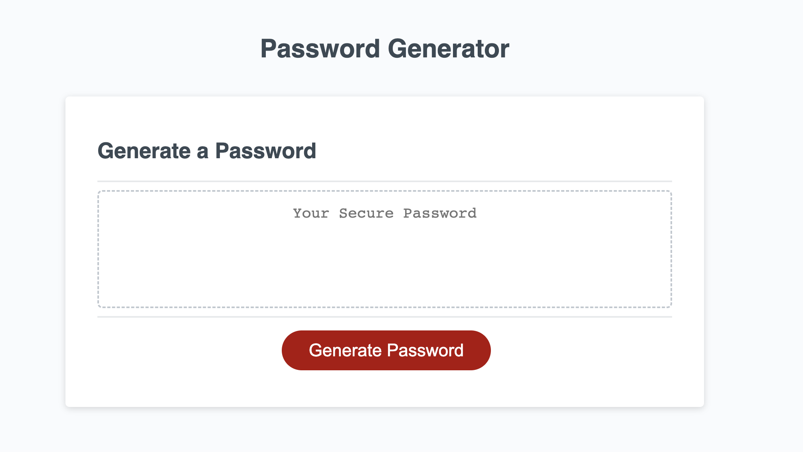
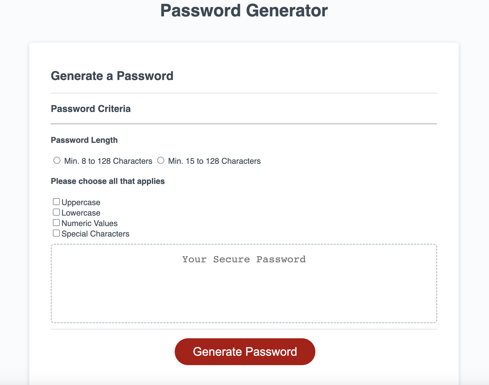

# The-Safe-Vault-Gate

## Description

This webpage was created to demonstrate the knowledge gained in the Javascript week in coding boot camp and as a part of the class assignment submission. The portfolio page was developed using HTML, CSS, and JS technology. When the user clicks the generate password button, the HTML asks for user input on password criteria. When the user inputs the details and clicks the generate button, the password is generated and displayed in the textarea element.

## Installation

N/A

## Usage

To use this webpage, click the HTML page, which will open in the browser. The view the code, open the webpage in an HTML editor. When opened in a browser, the HTML page is viewed as below.

The resource can be accessed from the link, https://github.com/Vigneshwarie/the-safe-vault-gate

## Credits

The getRandomArbitrary function was retrieved and modified from the MDN website.
The link to the website is https://developer.mozilla.org/en-US/docs/Web/JavaScript/Reference/Global_Objects/Math/random

The random string generation method is based on the Stackoverflow example.
The link to the site is https://stackoverflow.com/questions/43917622/how-to-create-random-string-in-javascript

## License

Please refer to the LICENSE in the repo.
